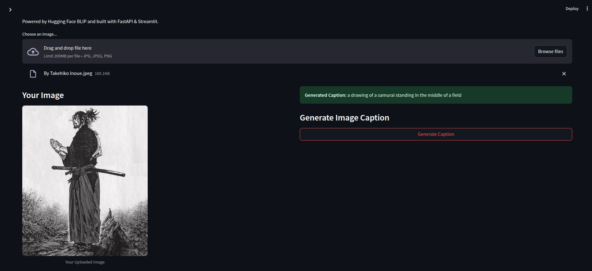
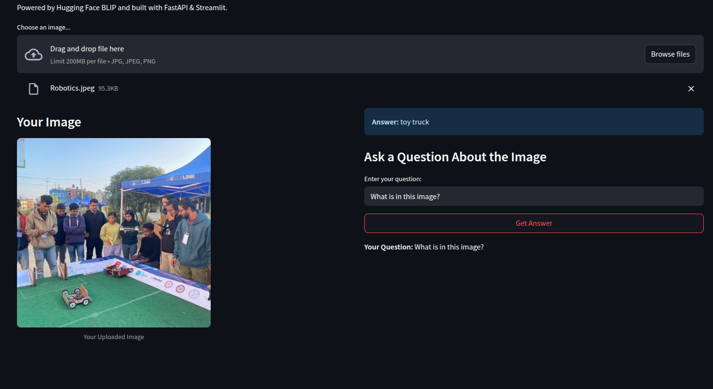

# Simple Multimodal AI Application

This project is a simple web application that uses a pretrained BLIP model to perform Image Captioning and Visual Question Answering (VQA). The application is built with a FastAPI backend to serve the model and a Streamlit frontend for the user interface.

## Architecture

The application is split into two main components:
-   **Backend (`/backend`)**: A FastAPI server that loads the `Salesforce/blip` models from Hugging Face and exposes API endpoints for captioning and VQA.
-   **Frontend (`/frontend`)**: A Streamlit user interface that allows users to upload an image, select a task, and interact with the backend to get results.

## How to Run

1.  **Clone the repository:**
    ```bash
    git clone git@github.com:Pranjalpok7/LLM-AICL-434-Assignments.git
    cd multimodal_app
    ```

2.  **Set up the Python environment:**
    ```bash
    python -m venv venv
    source venv/bin/activate  
    pip install -r requirements.txt 
    ```

3.  **Run the backend server:**
    Open a terminal, navigate to the `/backend` directory, and run:
    ```bash
    uvicorn main:app --reload
    ```

4.  **Run the frontend UI:**
    Open a *new* terminal, navigate to the `/frontend` directory, and run:
    ```bash
    streamlit run app.py
    ```

## Demo

Here is the application performing its two main tasks.

<p align="center">
  <b>Image Captioning</b><br>
  
</p>

<p align="center">
  <b>Visual Question Answering</b><br>
  
</p>


# How the Model (BLIP) Works: A Brief Explanation
BLIP stands for Bootstrapping Language-Image Pre-training. It's a multimodal model, meaning it's designed to understand information from more than one "mode" or type of data—in this case, images and text.


Think of it as a model with two "eyes" and two "ears" that have learned to connect what they see with what they hear (or read).

It's composed of three main parts:
1. Image Encoder: This part, usually a Vision Transformer (ViT), looks at an image and converts it into a series of numbers (a "vector representation"). It essentially captures the key visual features—objects, scenes, colors, textures.
2. Text Encoder/Decoder: This part understands and generates language. It can read a question and turn it into its own numerical representation, or it can take a set of concepts and turn them into a human-readable sentence (a caption).
3. Multimodal "Fusion" Encoder: This is the magic part. It's a special component that takes the numerical representations from both the image and the text and learns the relationship between them. It figures out which words in the text correspond to which parts of the image.

By training on a massive dataset of images and their corresponding text descriptions, BLIP learns to:

1. Caption Images: Given an image, it can generate a relevant text description.

2. Answer Visual Questions (VQA): Given an image and a question about it (e.g., "What color is the car?"), it can find the answer from the visual information.
